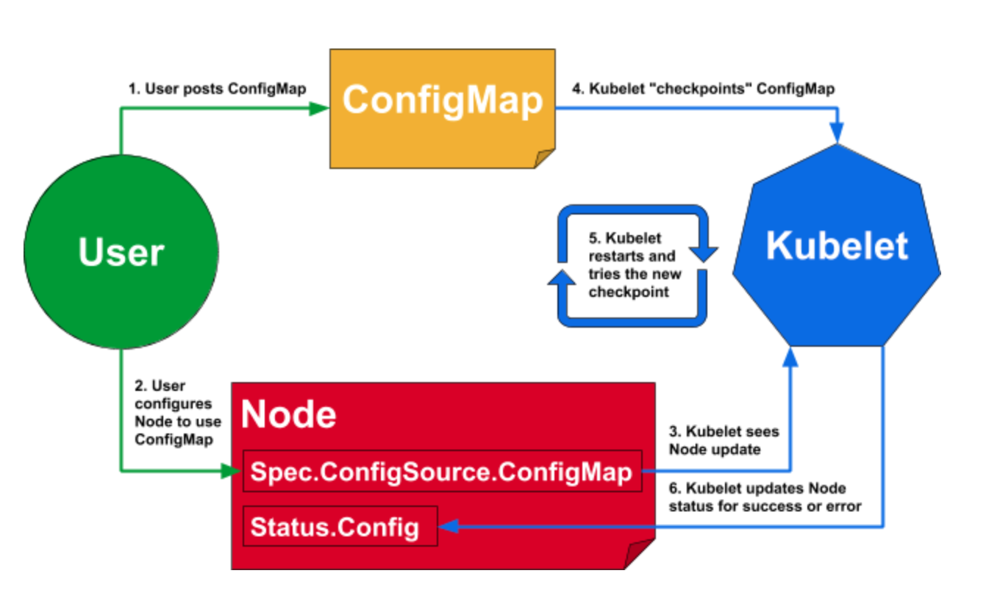

# Деплой с динамическим конфигурированием и горизонтальное масштабирование в Docker и Kubernetes

## Введение

### Обзор ключевых проблем​​​​ в развертывании​​ и масштабировании современных приложений

1. **Сложность управления конфигурациями**: Необходимо конфигурировать приложения для разного типа среды (прод, тест, разработка). Эти конфигурации должны корректно предоставлять доступы к различным сервисам.

2. **Горизонтальное масштабирование**: Грамотное распределение ресурсов между клонами при горизонтальном масштабировании.

3. **Высокая отказоустойчивость**: Быстрое и полное восстановление приложения в случае отказа.

4. **Обновления и откаты версий**: Необходима возможность обновления приложений без простоев, а так же возможность быстрого отката версии при обнаружении багов.

## Динамическое конфигурирование

**Динамическое конфигурирование** позволяет приложениям менять параметры без необходимости перезапуска или переразвертывания. Это особенно важно в облачных средах, где приложениям может потребоваться изменять свои настройки на лету из-за нагрузки, доступности ресурсов или других внешних факторов.

### Как это работает?

- Kubelet является основным "агентом узла", который запускается на каждом узле. Он может зарегистрировать узел на сервере api

- Kubelet пытается использовать динамически назначенную конфигурацию.

- Kubelet "проверяет" конфигурацию на локальном диске, позволяя перезапускать без доступа к серверу API.

- Kubelet сообщает о назначенных, активных и последних известных исправных источниках конфигурации в статусе узла.

- Когда динамически назначается недопустимая конфигурация, Kubelet автоматически возвращается к последней известной исправной конфигурации и сообщает об ошибках в статусе узла.
  
  На следующей диаграмме представлен общий обзор обновления конфигурации для одного узла
  
  

## Горизонтальное масштабирование

**Горизонтальное масштабирование** - добавление или удаление экземпляров приложения из-за увеличении или уменьшения загрузки

### Как этo работает?

**HPA(HorizontalPodAutoscaler)** - это один из способов автоматического масштабирования, встроенных в Kubernetes, используемый для масштабирования ресурсов, таких как развертывания, наборы реплик, контроллеры репликации и наборы с отслеживанием состояния

  

- Горизонтальное масштабирование означает, что ответом на увеличение нагрузки является развертывание большего количества Подов. Это отличается от *вертикального* масштабирования, которое для Kubernetes будет означать выделение большего количества ресурсов (например, памяти или ЦП) подам, которые уже работают для рабочей нагрузки.

- Если нагрузка снижается и количество модулей Pod превышает настроенный минимум, HorizontalPodAutoscaler дает указание ресурсу рабочей нагрузки (Deployment, StatefulSet или другому аналогичному ресурсу) уменьшить масштаб.
  
    

#### Со стороны клиента это выглядит так

   

На рисунке синяя штука — это Интернет, из которого идут запросы. Ставится балансировщик, единственная задача которого — распределить запросы на отдельные сервера, принять от них ответы и отдать клиенту. Смысл тут в том, что 3 сервера могут обработать (в идеале) в 3 раза больше запросов, исключая какие-то накладные расходы на сеть и на саму работу балансировщика.

## Практические кейсы

В нашем случае для наглядности напишем жадный алгоритм вычисления чисел фибоначи

```python
from flask import Flask, request, jsonify

app = Flask(__name__)


def fibonacci_recursive(n):
    if n <= 1:
        return n
    else:
        return fibonacci_recursive(n - 1) + fibonacci_recursive(n - 2)


@app.route('/fibonacci', methods=['GET'])
def get_fibonacci():
    n = request.args.get('n', default=0, type=int)
    if n < 0:
        return jsonify(error="n должно быть неотрицательным"), 400
    result = fibonacci_recursive(n)
    return jsonify(n=n, fibonacci=result)


if __name__ == '__main__':
    app.run(host='0.0.0.0', port=5000, debug=True)
```

Будем сравнивать нахождение 38-го числа фибоначи, отправляя запрос `http://localhost/fibonacci?n=1`  и смотрим время ответа

Создадим самый простой `Dockerfile`

```docker
FROM python:3.9-slim

WORKDIR /app

COPY . /app

RUN pip install Flask

CMD ["python", "main.py"]
```

и соответственно `Deployment` и `Service` в файле deployment.yaml

```yaml
apiVersion: apps/v1
kind: Deployment
metadata:
  name: fibo-deployment
spec:
  replicas: 2
  selector:
    matchLabels:
      app: fibo
  template:
    metadata:
      labels:
        app: fibo
    spec:
      containers:
      - name: fibo
        image: poma12390/fibo:latest
        ports:
        - containerPort: 5000
---
apiVersion: v1
kind: Service
metadata:
  name: fibo-service
spec:
  type: LoadBalancer
  selector:
    app: fibo
  ports:
    - protocol: TCP
      port: 80
      targetPort: 5000
```

### Сборка и Загрузка Docker образа

#### Собираем docker образ

```bash
docker build -t fibo .
```

#### Загружаем образ в docker hub

```bash
docker push <user>/fibo:latest
```

### Развертывание в Kubernetes

#### Установка Minikube

Для развертывания нашего одноузлового приложения потребуедтся дополнительно поставить Minikube, он позволяет удобнее подключать модули и получать статистику
[Документация по Minikube](https://kubernetes.io/ru/docs/tasks/tools/install-minikube/)

#### Запуск Minikube

```bash
minikube start
```

#### Применяем конфигурацию Kebernetes

```bash
kubectl apply -f deployment.yaml
```

#### Получем ip и порт

```bash
kubectl get svc
```

```bash
NAME           TYPE              EXTERNAL-IP   PORT(S)        AGE
fibo-service   LoadBalancer      localhost     80:30542/TCP   49m
```

Здесь стоит обратить внимание на type: `TYPE: LoadBalancer` это означает, что входящие запросы будут распределяься между двумя подами.

Запросы будет отправлять командой типа

```bash
(time (
curl -s 'http://127.0.0.1:port/fibonacci?n=38' & 
...
curl -s 'http://127.0.0.1:port/fibonacci?n=38' & 
wait
)) 2>&1
```

Порт получим с помощью запуска зервиска minikube командой `minikube service fibo-service --url`
Будем отправлять 32 запросов одновременно, чтобы смоделировать нагрузку на сервер

### Результат при двух подах

Время выполнения запроса

```bash
real    4m58.248s
user    0m0.156s
sys     0m0.313s
```

Как мы видим идеальный параллельности не получилось, 32 запросов на 2 пода выполнились, как 6 запросов на 1.

Давайте воспользуемся горизонтальным масштабированием и выставим 4 пода
Запустим тот же тест с 32 запросами

### Результат при четырех подах

Время выполнения запроса

```bash
real    3m32.187s
user    0m0.094s
sys     0m0.344s
```

Как мы видим результат стал лучше, но тогда возникает вопрос, какое оптимальное количество подов?
Чем больше подов, тем, с одной стороны, больше запросов мы сможем обработать, но с другой стороны, больше ресурсов занимают.
Таким образом, если нагрузка на сервер не постоянная, то в нагруженные запросы будут обрабатываться долго, а в не нагруженные поды будут простаивать, занимая ресурсы сервера.

## Настройка динамической конфигурации

Для добавления возможности получать метри о ресурсах процессота добавим в deployment.yaml

```yaml
#deployment.yaml
    spec:
      containers:
      - name: fibo
        image: <user>/fibo:latest
        ports:
        - containerPort: 5000
        resources:
          requests:
            cpu: "100m"
```

Далее на понадобится [Metrics server](https://kubernetes.io/docs/tasks/debug/debug-cluster/resource-metrics-pipeline/)
Можно установить его вручную, но мы используем Minikube, поэтому достаточно команды

```bash
minikube addons enable metrics-server
```

Теперь можно добавить HPA в наш кластер

```bash
kubectl autoscale deployment fibo-deployment --cpu-percent=50 --min=1 --max=10
```

В данном случае HPA будет стараться масштабировать поды так, чтобы среднее использование CPU подами, управляемыми Deployment, было около 50%.
Соответственно указываем минимально и максимально количество подов.

Для проверки напишем команду `kubectl get hpa`
В консоли должна появится информация

```bash
NAME              REFERENCE                    TARGETS   MINPODS   MAXPODS   REPLICAS   AGE
fibo-deployment   Deployment/fibo-deployment   2%/50%    1         10        2          8h
```

Также при выводе команды `kubectl top pods`
можно посмотреть загрузку по подам

```bash
NAME                               CPU(cores)   MEMORY(bytes)
fibo-deployment-7c5d96f49d-2ndh7   215m         43Mi
fibo-deployment-7c5d96f49d-4nkjv   1m           38Mi
```

В нашем случае  у нас оба пода не загружены. Как только загрузка достигнет 500m, HPA создаст новые поды, на которые будут попадать запросы.
Через некоторе время, если загрузка не будет превышать 500m, то HPA удалит лишние поды.

Теперь отправим все те же 10 запросов на сервер и подсмотрим на поды.

Изначально ничего не меняется, но потом при выводе команды `kubectl get pods` мы видим

```bash
C:\Users\pomat\Documents\Itmo\balancer\test>kubectl get pods
NAME                               READY   STATUS              RESTARTS       AGE
fibo-deployment-7c5d96f49d-2ndh7   1/1     Running             2 (2m5s ago)   14m
fibo-deployment-7c5d96f49d-4nkjv   1/1     Running             2 (2m5s ago)   14m
fibo-deployment-7c5d96f49d-5l7ds   1/1     ContainerCreating   0              1s
fibo-deployment-7c5d96f49d-75kcw   1/1     Running             0              16s
fibo-deployment-7c5d96f49d-9jgrb   1/1     Running             0              16s
fibo-deployment-7c5d96f49d-kpn58   1/1     ContainerCreating   0              1s
fibo-deployment-7c5d96f49d-mtjlr   1/1     Running             0              16s
fibo-deployment-7c5d96f49d-rrr2r   1/1     Running             0              16s
fibo-deployment-7c5d96f49d-tvmkb   1/1     Running             0              16s
fibo-deployment-7c5d96f49d-wdgdl   0/1     ContainerCreating   0              1s
```

У нас начали появлятся новые поды, некоторые из которых только запускаются. Соответственнонаш балансировщик будет отдавать им запросы на выполнение.
Через некоторое время выполним `kubectl get hpa`

```bash
NAME              REFERENCE                    TARGETS    MINPODS   MAXPODS   REPLICAS   AGE
fibo-deployment   Deployment/fibo-deployment   815%/50%   1         10        10         9h
```

У нас загрузка более 50%, а значит HPA создаст новые поды
Выполним `kubectl top pods` и увидим

```bash
NAME                               CPU(cores)   MEMORY(bytes)
fibo-deployment-7c5d96f49d-2ndh7   818m         44Mi
fibo-deployment-7c5d96f49d-4nkjv   8m           38Mi
fibo-deployment-7c5d96f49d-5l7ds   18m          38Mi
fibo-deployment-7c5d96f49d-75kcw   15m          38Mi
fibo-deployment-7c5d96f49d-9jgrb   11m          38Mi
fibo-deployment-7c5d96f49d-kpn58   807m         43Mi
fibo-deployment-7c5d96f49d-mtjlr   9m           38Mi
fibo-deployment-7c5d96f49d-rrr2r   13m          38Mi
fibo-deployment-7c5d96f49d-tvmkb   9m           38Mi
fibo-deployment-7c5d96f49d-wdgdl   814m         43Mi
```

В данный момент у нас работают 10 подов одновременно, но суда по значениям только 3 из них активно что-то считают

### Результат с динамической конфигурацией

Время выполнения запроса

```bash
real    1m54.121s
user    0m0.041s
sys     0m0.124s
```

Как мы видим, у нас 32 запроса отработало на 1-10 подов в 2 раза быстрее, чем на 4, что показывает ее эффективность

## Вывод

| Сценарий                        | Нужны ли доп. технологии        | Время выполнения  |
|---------------------------------|---------------------------------|-------------------|
| Результат при двух подах        | Нет                             | 4m 58.248s        |
| Результат при четырех подах     | Нет                             | 3m 32.187s        |
| Результат с динамической конф.  | Да (HPA, Metrics Server      )  | 1m 54.121s        |

Динамическая конфигурация очень эффективна в системах с непостоянной нагрузкой, ведь она может увеличить или уменьшить количество подов для экономии ресурсов.

Грамотно настроить ее конфигурацию не так просто, и требует особых знаний.

Горизонтальное масштабирование подов увеличивает пропускную способность сервера, но во время малой нагрузки на него впустую потребляет ресурсы.

Всегда нужно искать баланс между временем и ресурсами и тогда сервер сможет быть удобным для испольования и не тратить много лишних ресурсов.
