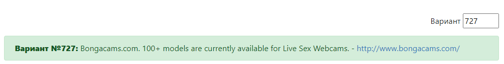

# Лабораторная №3 - по ТПО
## Задание
Сформировать варианты использования, разработать на их основе тестовое покрытие и провести функциональное тестирование интерфейса сайта (в соответствии с вариантом).

### Вариант 727:



### Требования к выполнению работы:
1. Тестовое покрытие должно быть сформировано на основании набора прецедентов использования сайта.
2. Тестирование должно осуществляться автоматически - с помощью системы автоматизированного тестирования [Selenium](http://docs.seleniumhq.org/).
3. Шаблоны тестов должны формироваться при помощи Selenium IDE и исполняться при помощи Selenium RC в браузерах Firefox и Chrome.
4. Предполагается, что тестируемый сайт использует динамическую генерацию элементов на странице, т.е. выбор элемента в DOM должен осуществляться не на основании его ID, а с помощью [XPath](http://ru.wikipedia.org/wiki/XPath).

## Расположение файлов
+ [Main](./src/main/java/org/example) `<- Классы с логикой`
+ [Tests](./src/test/java/org/example) `<- Классы для тестирования`

## Полезная информация
+ [JUnit 5](https://www.baeldung.com/parameterized-tests-junit-5)
+ [Selenium Java](https://habr.com/ru/post/502292/)
+ [BongaCams](http://www.bongacams.com/)

## Шаблон тестирующего метода
```
@Test
@DisplayName("Test name")
void testName() {
    assertAll(
        () -> assertEquals(1, 1)
    );
}
```

```
@ParameterizedTest
@DisplayName("Parameterized test name")
@ValueSource(its = {1})
void parameterizedTestName(int param) {
    assertAll(
        () -> assertEquals(1, param)
    );
}
```